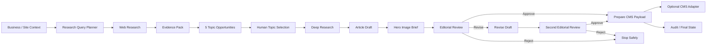

# AI Blog Research & Publishing Pipeline

An evidence-driven **content research, drafting, approval, and publishing workflow** built with **n8n + LLMs + web research + human review**.

This is not a "prompt → blog post" generator.

The pipeline researches current demand first, creates topic opportunities tied to real sources, pauses for a human to choose the direction, performs deeper research, drafts the article, generates a hero-image brief, pauses again for editorial approval, and only then prepares the content for publishing.

> **Portfolio implementation:** this repository is a sanitized public version of a workflow pattern used in real automation work. It contains no private production credentials, customer data, internal endpoints, or proprietary project code.

## What this project demonstrates

- research before generation
- evidence-backed topic discovery
- structured topic ranking without auto-publishing
- human topic selection
- deeper second-pass research
- source-aware article drafting
- duplicate-topic avoidance
- SEO metadata generation
- hero-image creative brief generation
- editorial Approve / Revise / Reject gate
- second approval after revision
- generic CMS publishing adapter
- explicit content state and audit output

## Architecture



## Why this is different from a generic AI blog generator

A basic workflow does this:

```text
Topic → LLM → Article
```

This project separates **research, editorial judgment, writing, and publishing**:

```text
business context
      ↓
current evidence
      ↓
topic opportunities
      ↓
human choice
      ↓
deeper evidence
      ↓
draft
      ↓
human approval
      ↓
publish adapter
```

The model is never asked to invent "what is trending" from memory. Research evidence is collected before topic generation and retained through the pipeline.

## Input

Example:

```json
{
  "site_url": "https://example.com",
  "business_summary": "A B2B automation studio helping growing companies reduce manual work with AI workflows.",
  "audience": "Operations and growth leaders at small and mid-sized companies",
  "content_goal": "Generate qualified inbound interest for AI automation services",
  "existing_topics": [
    "What is workflow automation?",
    "Five ways to automate lead routing"
  ]
}
```

See [examples/sample-input.json](examples/sample-input.json).

## Stage 1 — Research query planning

The LLM creates a small set of search queries based on:

- what the business actually offers
- target audience
- content goal
- current information gaps
- topics already published

The output is structured, not free-form.

## Stage 2 — Evidence collection

The included workflow uses a Tavily HTTP request as the default public research adapter.

Each result is normalized into an evidence record containing fields such as:

```json
{
  "title": "Source title",
  "url": "https://source.example/article",
  "snippet": "Relevant source text...",
  "query": "original search query"
}
```

The research adapter can be replaced with another search/research provider.

## Stage 3 — Evidence-backed topic opportunities

The model receives the evidence pack and returns **five topic opportunities**.

Each topic includes:

- title
- angle
- target reader
- search/business intent
- why the topic matters now
- supporting source URLs
- confidence
- overlap warning against existing topics

A topic without usable evidence should be downgraded rather than presented as a trend.

## Stage 4 — Human topic selection

The workflow pauses using an n8n Wait node.

The reviewer chooses a topic number:

```json
{
  "topic_number": 2,
  "reviewer": "editor"
}
```

The model does not automatically choose what gets written.

## Stage 5 — Deep research

The selected topic triggers a second, narrower research pass.

This gives the draft its own evidence set instead of relying only on the initial discovery snippets.

## Stage 6 — Article generation

The article generator receives:

- selected topic
- business context
- deep-research evidence
- source URLs
- editorial constraints

It returns a structured article package:

- title
- slug
- excerpt
- Markdown body
- meta title
- meta description
- source list
- claims-to-check

The prompt explicitly tells the model not to fabricate statistics, quotes, customer claims, or research findings.

## Stage 7 — Hero-image brief

A separate AI step creates a **creative brief**, not a generic "AI image prompt."

It includes:

- visual concept
- subject / scene
- composition
- mood
- what to avoid
- optional generation prompt

This keeps the visual direction separate from article writing.

## Stage 8 — Editorial approval

The editor can:

```text
approve
revise
reject
```

A revision includes feedback and returns to a **second approval gate**.

Revision never means automatic approval.

## Stage 9 — CMS publishing adapter

The public workflow stops at a normalized CMS payload:

```json
{
  "title": "...",
  "slug": "...",
  "excerpt": "...",
  "body_markdown": "...",
  "meta_title": "...",
  "meta_description": "...",
  "hero_brief": {...},
  "sources": [...]
}
```

An optional HTTP node can be connected to Sanity, WordPress, Ghost, a custom CMS, or another publishing API.

The example CMS node is disabled by default so importing the workflow cannot publish anything accidentally.

## Repository structure

```text
.
├── workflow/
│   └── blog-research-publishing-pipeline.json
├── docs/
│   ├── architecture.md
│   ├── evidence-contract.md
│   └── state-machine.md
├── examples/
│   ├── sample-input.json
│   ├── topic-selection.json
│   └── editorial-decisions.json
├── .env.example
├── LICENSE
└── README.md
```

## Safety and quality boundaries

The workflow intentionally avoids several common content-automation failure modes:

### No research-free trend claims
The topic generator must work from collected evidence.

### No automatic publishing
A human must approve the final article package.

### No invented source list
Source URLs come from the research stage.

### No hidden business logic inside one giant prompt
Research planning, topic generation, drafting, visual direction, review, and publishing are separate stages.

### No accidental CMS writes
The publishing adapter is disabled in the portfolio workflow.

## Setup

### 1. Import the workflow

Import:

```text
workflow/blog-research-publishing-pipeline.json
```

into n8n.

### 2. Configure an LLM

The workflow uses an OpenAI-compatible chat model by default. It can be replaced with another n8n-supported model provider.

### 3. Configure research

Set:

```text
TAVILY_API_KEY
```

or replace the Tavily HTTP nodes with your preferred search provider.

### 4. Submit the sample input

Send the contents of:

```text
examples/sample-input.json
```

to the webhook.

### 5. Make a topic choice

When the workflow reaches **Wait for Topic Selection**, use the resume URL from the approval packet and POST:

```json
{
  "topic_number": 1,
  "reviewer": "editor"
}
```

### 6. Review the article

At the editorial gate, POST an Approve / Revise / Reject decision using the examples provided in the repository.

## Planned validation

This repository is **not yet marked as tested**.

During the later testing pass, validation will cover:

- research query generation
- evidence retrieval
- five-topic output
- duplicate-topic avoidance
- topic selection
- source-aware drafting
- missing/weak evidence behavior
- editorial approval
- revision followed by second approval
- rejection path
- CMS payload generation
- failed research API response
- malformed approval payload

Screenshots and execution evidence will be added after live testing.

## License

MIT License. See [LICENSE](LICENSE).
